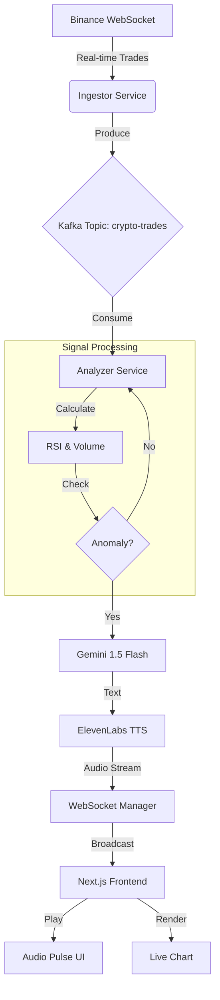

# PulseTrade AI: Crypto Edition

**Real-time Crypto Anomaly Detector with AI Voice Commentary**

---

## What It Does

PulseTrade AI listens to the heartbeat of the crypto market (Binance WebSocket), detects anomalies in real-time, and uses **Generative AI** to narrate the action like a professional sports commentator.

Instead of staring at charts, you **listen** to the market.

| Feature | Tech Stack | Implementation |
|---------|------------|----------------|
| **The Ears** | **Binance WebSocket** | Listens to every trade for BTC, ETH, SOL (100+ events/sec). |
| **The Nervous System** | **Apache Kafka** | Buffers high-velocity data using Confluent Cloud. |
| **The Brain** | **Gemini 1.5 Flash** | Analyzes technical signals (RSI, Volume) to generate insights. |
| **The Voice** | **ElevenLabs Turbo v2.5** | Converts AI text to ultra-low latency speech. |
| **The Face** | **Next.js + TradingView** | Real-time dashboard with "Audio Pulse" visualization. |
| **The Guardian** | **Datadog APM** | Traces every AI generation and API call (Region: US5). |

---

## Architecture



### Key Flows
1.  **Ingestion**: `Ingestor` service connects to `wss://stream.binance.com:9443` and pushes normalized trade events to Kafka.
2.  **Analysis**: `Analyzer` service consumes from Kafka. It calculates 1-second candles, RSI(14), and Rolling Volume Volume.
3.  **Trigger**: If `RSI > 70` or `Volume > 5x`, it prompts **Gemini** with the market context.
4.  **Voice**: Gemini's response is streamed to **ElevenLabs**, which returns an audio buffer.
5.  **Delivery**: Audio is pushed via WebSocket to the frontend, which handles the playback queue.

---
## Tech Stack

### Backend (Python)
*   **FastAPI**: High-performance async web framework.
*   **Confluent Kafka**: Robust messaging queue for decoupling ingestion from analysis.
*   **Google GenAI SDK**: Interface for Gemini 1.5 Flash.
*   **ElevenLabs SDK**: Text-to-Speech generation.
*   **Datadog (`ddtrace`)**: Distributed tracing and performance monitoring.
*   **Numpy**: Vectorized calculations for technical indicators.

### Frontend (TypeScript)
*   **Next.js 14**: App Router architecture.
*   **TradingView Lightweight Charts**: Canvas-based high-performance charting.
*   **ShadCN UI + Tailwind**: Modern, dark-mode aesthetic.
*   **Native WebSockets**: For bi-directional real-time communication.

---

## Quick Start

### Prerequisites
*   Docker & Docker Compose
*   (Optional) API Keys for Gemini, ElevenLabs, Confluent, Datadog

### 1. Clone & Configure
```bash
git clone https://github.com/webbedpiyush/pulsetrade-ai.git
cd pulsetrade-ai

# Rename example env files (if provided) or create new ones
cp backend/.env.example backend/.env
```

### 2. Run with Docker
The entire stack (Frontend + Backend + Datadog Agent) runs in containers.

```bash
docker compose up --build
```

### 3. Open Dashboard
Visit **http://localhost:3000**

*   **Interactive Chart**: Watch live BTC/ETH/SOL prices.
*   **Audio Pulse**: See the green circle pulse when the AI speaks.
*   **Debug Mode**: Click "Force Alert" to simulate a Whale Move (if market is quiet).

---

## Project Structure

```
pulsetrade-ai/
├── backend/
│   ├── app/
│   │   ├── services/
│   │   │   ├── ingestor.py       # Binance -> Kafka
│   │   │   ├── analyzer.py       # Kafka -> Logic -> Gemini
│   │   │   └── voice.py          # ElevenLabs Handler
│   │   ├── indicators/
│   │   │   ├── rsi.py            # Time-based RSI
│   │   │   ├── volume.py         # Volume Spike Detection
│   │   │   └── price.py          # Level Crossing Logic
│   │   └── main.py               # FastAPI & WebSocket Hub
│   ├── tests/                    # Pytest Suite
│   └── Dockerfile
├── frontend/
│   ├── src/
│   │   ├── components/
│   │   │   ├── LiveChart.tsx     # TradingView Wrapper
│   │   │   ├── AIPulse.tsx       # Voice Visualizer
│   │   │   └── KafkaLogs.tsx     # Data Stream View
│   │   ├── hooks/
│   │   │   └── useAudio.ts       # Audio Buffer Management
│   │   └── providers/
│   │       └── WebSocketProvider.tsx # socket connection
│   └── Dockerfile
└── docker-compose.yml
```

---

## Verification & Testing

### Running Tests
We have a comprehensive test suite for the financial logic.
```bash
cd backend
pytest tests/
```

### Verifying Signal Latency
1.  **Ingestion**: < 50ms from Binance.
2.  **Analysis**: < 10ms processing time.
3.  **AI Generation**: ~600-800ms (Gemini Flash).
4.  **Voice Synthesis**: ~400ms (ElevenLabs Turbo).
5.  **Total Latency**: ~1.5s from "Market Event" to "Voice Alert".

---

Built with ❤️ by Piyush for the Hackathon.
